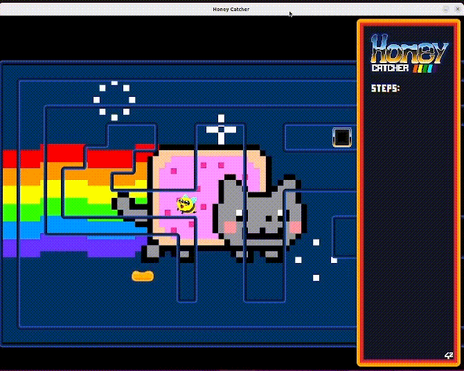

# so_long

42Curriculum project

This project is a 2D game made in C where we use the [MiniLibX](https://harm-smits.github.io/42docs/libs/minilibx) (this documentation is quite usefull) graphical library. 


## Project Rules
  * Ther player must be able to move in the X & Y axis.
  * When running the program we must add a map file as an argument
  * The map can only be composed of 5 characters: Wall (1), Floor (0), Starting position (P), Collectible (C) and Exit (E). As part of the bonus I've added enemies so I used an 'X' for their starting position.
  * The map must contain 1 exit, at least 1 collectible, and 1 starting position to be valid.
  * If the map contains duplicate characters (exit/start), an error message should be displayed.
  * The map must be rectangular.
  * The map must be enclosed/surrounded by walls. If it is not, the program must return an error.
## My implementation
  As a 2D game the projects gives a lot of room for creativity so I decided to have some fun with it.
  I have an "object" structure where I keep all the relevant information for every element in the game: 
```
    typedef struct s_objt
    {
	    int				x;
	    int				y;
      char			type;
	    t_img			img;
	    struct s_objt	*next;
    }				t_objt;
```
  The structure acts as a linked list, with every node being an object in the game (walls, player, collectibles, exits and enemies)
  Further more as I added the option to switch into sprites of a width/height of 64 48 32 and 16 pixels the method I used to call the list was the following:
   
```
t_objt	**objects(int n)
{
	static t_objt	*obj;
	static t_objt	*obj2;
	static t_objt	*obj3;
        static t_objt	*obj4;

	if (n == 64)
		return (&obj);
	if (n == 48)
		return (&obj2);
	if (n == 32)
		return (&obj3);
	if (n == 16)
		return (&obj4);
	else
		return (NULL);
}
```
This way I can easily change which size I'm using. (In-game this change ocurrs using the up and down arrows)
As illustrated in the images, the game has a side view and the character is centered on the screen, further more there are multiple wall sprites so they connect seamleslly.
The game runs on a loop continuously printing every asset into a frame before replacing the old one.
Animations are handled by checking how much time has passed since the last update, and advancing if it passes a defined threshold.

```
int game(t_win *win)
{
	win->frame.img = mlx_new_image(win->mlx, win->width + SIDEINFO, win->height);
	win->frame.width = win->width + SIDEINFO;
	win->frame.height = win->height;
	win->frame.addr = mlx_get_data_addr(win->frame.img, &(win->frame.bits_per_pixel),
			&(win->frame.line_length), &(win->frame.endian));
	move_character(keys()->d - keys()->a, keys()->s - keys()->w);
	animations(win);
	print_to_window(win);
	mlx_put_image_to_window(win->mlx, win->mlx_win, win->frame.img, 0, 0);
	mlx_destroy_image(win->mlx, win->frame.img);
}
```

## Backgrounds
The game supports a series of frames as a background to create a sort of gif

Given you have the frames ordered by name, from 1 to 'N', with 'N' being the total number of frames (ex. Nyan1, Nyan2, Nyan3 .. Nyan'N') all thats needed to do is change the defines to the respective values
```
# define GIF_NAME "Nyan"
# define FRAME_NBR 12
```




